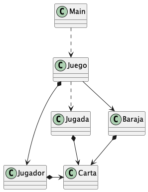
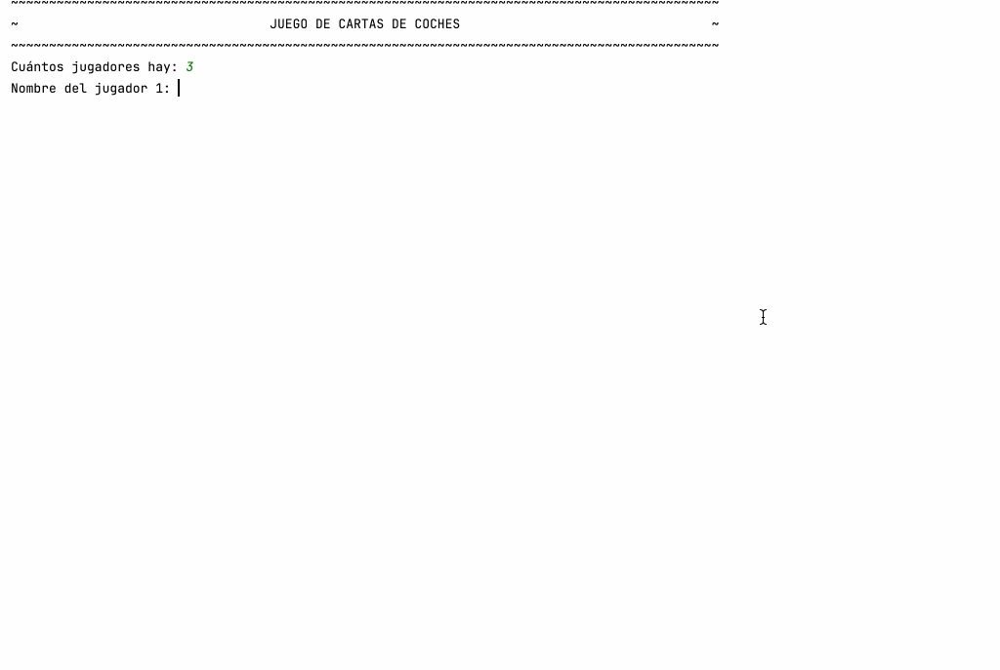

<!-- Based on the Best-README-Template. -->

<h1 align="center">Proyecto UT5   CartasCoches-arrays</h1>

---
<!-- TABLE OF CONTENTS -->

  
Índice

  <ol>
    <li>
      <a href="#Introducción">Introducción</a>
    </li>
    <li>
      <a href="#Diagramas-de-clases">Diagramas de clases</a>
    </li>
    <li>
      <a href="#Juego-de-cartas-de-coches">Juego de cartas de coches</a>
    </li>
    <li>
      <a href="#Evaluación">Evaluación</a>
    </li>
    <li>
      <a href="#Licencia">Licencia</a>
    </li>
  </ol>

---
<h2 id="Introducción">Introducción</h2>

La aplicación CartasCoches-arrays es la nueva versión del proyecto CartasCoches que utiliza arrays. En este caso no hay una limitación en el número de jugadores, se pedirá por consola el número de participantes y luego se solicitará el nombre a cada uno (orden en el que jugarán). La mecánica del juego es similar a la anterior versión, pero en este caso se revolverán las cartas de la baraja y se repartirán entre todos los jugadores la misma cantidad, pudiendo quedar cartas sin repartir por no ser el número de cartas de la baraja múltiplo del número de jugadores. La lógica de sacar y meter cartas sigue siendo de tipo LIFO (Last In First Out) o pila. En cada turno un jugador sacara una carta y decidirá con qué característica quiere competir. A continuación se muestran las cartas de todos los jugadores y se indica quienes son los ganadores (en caso de empate puede ganar más de un jugador, por ej. si todos los coches corren a 200km/h todos ganan a velocidad). El juego termina con la última jugada en la que todos los jugadores juegan con su última carta. Finalmente se muestran los resultados indicando las veces que ha ganado cada jugador.

(<a href="#readme-top">volver al inicio</a>)

<h2 id="Diagramas-de-clases">Diagramas de clases</h2>

El juego se ejecuta mediante la clase principal Main que crea y utiliza una instancia de Juego.
Al ejecutarlo se hace una presentación del juego, se crean los jugadores, se reparten las cartas, se juega y finalmente se muestran los resultados.
La baraja tiene una lista de cartas que al principio se pueden revolver y repartir a los jugadores que apilaran en sus pilas o montones de cartas.
Un juego tiene una baraja de cartas, un conjunto de jugadores de los cuales lleva unos contadores con las partidas ganadas y un indicador de turno.
Los jugadores tienen nombre y una pila de cartas de la cual irán sacando una en cada jugada.
Cada jugada comprende un conjunto de cartas formado por la carta correspondiente de cada jugador en ese turno.

(<a href="#readme-top">volver al inicio</a>)

<h2 id="Juego-de-cartas-de-coches">Juego de cartas de coches</h2>

En la carpeta doc del proyecto se puede observar un ejemplo de la ejecución del programa ejecucion.txt. Igualmente se facilitan los resultados tras la ejecución de las clases de prueba.

[Demo ejecución texto](doc/demo/ejecucion.txt)

(<a href="#readme-top">volver al inicio</a>)

<h2 id="Evaluación">Evaluación</h2>

El código debe compilar, si hay algún fragmento que se deba considerar pero no compila coméntalo y agrega una pequeña explicación. Si el código no compila se penalizará hasta 5 puntos sobre 100.

|  Clase   | TODO | Elemento                  | Punt. |
|:--------:|-----:|---------------------------|------:|
|  Baraja  |   10 | *Escribe tu nombre*       |     1 |
|  Baraja  |   11 | revolver                  |     7 |
|  Baraja  |   12 | sacarCarta                |     4 |
|  Baraja  |   13 | getNumeroCartasPendientes |     2 |
|  Baraja  |   14 | getNumeroCartasSacadas    |     2 |
|  Baraja  |   15 | getNumeroCartasTotales    |     2 |
| Jugador  |   20 | *Escribe tu nombre*       |     1 |
| Jugador  |   21 | constructor Jugador       |     4 |
| Jugador  |   22 | meterCarta                |     3 |
| Jugador  |   23 | sacarCarta                |     5 |
|  Jugada  |   30 | *Escribe tu nombre*       |     1 |
|  Jugada  |   31 | constructor Jugada        |     2 |
|  Jugada  |   32 | ganadores                 |    13 |
|  Jugada  |   33 | pintarJugadores           |     7 |
|  Jugada  |   34 | pintarCarta               |     2 |
| Juego    |   40 | *Escribe tu nombre*       |     1 |
| Juego    |   41 | crearJugadores            |     7 |
| Juego    |   42 | numeroJugadores           |     2 |
| Juego    |   43 | setJugadores              |     3 |
| Juego    |   44 | getJugador                |     2 |
| Juego    |   45 | repartirCartas            |     9 |
| Juego    |   46 | jugar                     |     4 |
| Juego    |   47 | jugarJugada               |     5 |
| Juego    |   48 | avanzarTurno              |     3 |
| Juego    |   49 | actualizarContadores      |     4 |
| Juego    |   50 | mostrarGanadores          |     4 |

(<a href="#readme-top">volver al inicio</a>)

<h2 id="Licencia">Licencia</h2>

This work is marked with <a href="http://creativecommons.org/publicdomain/zero/1.0?ref=chooser-v1" target="_blank" rel="license noopener noreferrer" style="display:inline-block;">CC0 1.0</a>

(<a href="#readme-top">volver al inicio</a>)

